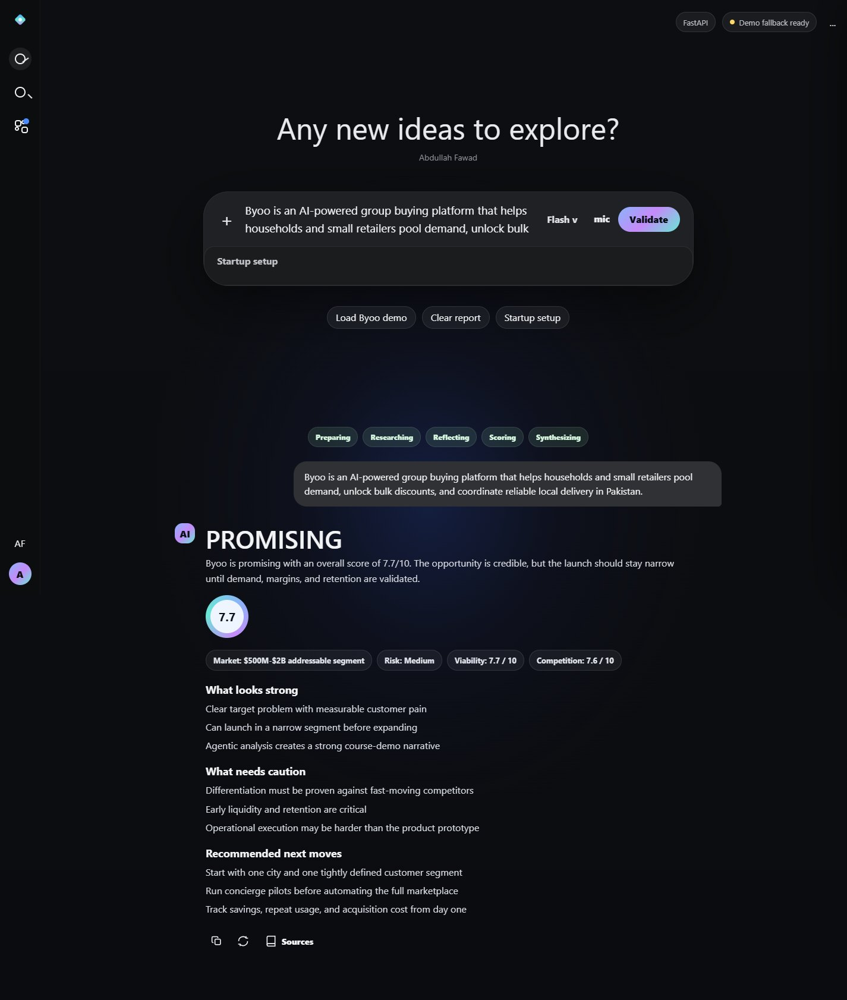
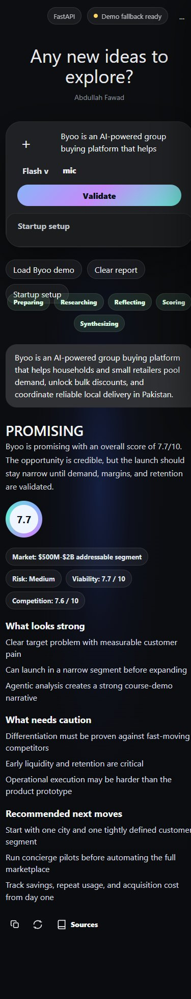

# AI Startup Idea Validator

Professional GenAI course project by **Abdullah Fawad**.

This project validates a startup idea with three specialist agents and an orchestrator:

- **Market Research Agent**: ReAct pattern with Tavily and Wikipedia.
- **Risk & SWOT Agent**: Reflection pattern with generator, critic, and revision rounds.
- **Business Viability Scorer**: Tool Use pattern with deterministic business-analysis tools.
- **Orchestrator**: Hub-and-spoke synthesis, conflict detection, and final investor-style verdict.





## Architecture

```text
User Input
    |
    v
Orchestrator
    |------------------|------------------|
    v                  v                  v
Market ReAct       Risk Reflection     Viability Tool Use
    |                  |                  |
    |------------------|------------------|
    v
Final Verdict + Score + Recommendations
```

## Features

- Premium single-file frontend with a modern AI-product dashboard feel.
- FastAPI backend with typed validation, health checks, CORS, and structured responses.
- Real Groq and Tavily integrations when keys are configured.
- Demo fallback mode for reliable course presentation when external APIs are unavailable.
- Importable n8n workflow with the same response shape as FastAPI.
- Collapsible ReAct trace, Reflection critiques, and Tool Use logs for grading.
- README screenshots committed under `docs/screenshots/`.

## Setup

```bash
python -m venv .venv
.venv\Scripts\Activate.ps1
pip install -r requirements.txt
copy .env.example .env
```

Edit `.env` and add:

```bash
GROQ_API_KEY=your_key
TAVILY_API_KEY=your_key
```

Run the backend:

```bash
uvicorn main:app --reload
```

Open:

```text
http://localhost:8000
```

## API

### Health

```bash
curl http://localhost:8000/health
```

### Validate

```bash
curl -X POST http://localhost:8000/validate ^
  -H "Content-Type: application/json" ^
  -d "{\"startup_name\":\"Byoo\",\"idea_description\":\"Byoo is an AI-powered group buying platform that helps households and small retailers pool demand, unlock bulk discounts, and coordinate reliable local delivery in Pakistan.\",\"industry\":\"E-commerce\",\"target_market\":\"Urban households and small retailers\",\"geography\":\"Pakistan\",\"team_size\":3,\"timeline_months\":8,\"unique_value_prop\":\"AI demand pooling for bulk discounts and better local supplier matching\"}"
```

## Response Shape

```json
{
  "execution_mode": "sequential",
  "execution_time_s": 12.4,
  "specialist_reports": {
    "market_research": {},
    "risk_swot": {},
    "viability_scorer": {}
  },
  "conflicts_detected": [],
  "final_evaluation": {
    "verdict": "VIABLE WITH CAUTION",
    "overall_score": 7.2,
    "top_strengths": [],
    "top_concerns": [],
    "recommendations": [],
    "summary": ""
  }
}
```

## n8n Version

Import:

```text
n8n/startup-validator-workflow.json
```

Then configure `GROQ_API_KEY` and `TAVILY_API_KEY` in n8n. See [n8n/README.md](n8n/README.md).

The frontend can point to n8n by changing the script config in `frontend/index.html`:

```js
window.STARTUP_VALIDATOR_API_URL = "https://your-n8n-instance.com/webhook/startup-validator";
window.STARTUP_VALIDATOR_BACKEND_LABEL = "n8n";
```

## Tests

```bash
pytest
```

## Project Structure

```text
agents/       Specialist agent implementations
core/         Settings, Groq wrapper, JSON parsing helpers
schemas/      Pydantic models and tool schemas
tools/        Tavily/Wikipedia and deterministic business tools
frontend/     Single-file premium UI
n8n/          Importable n8n workflow and setup guide
tests/        Business tool and orchestrator checks
```

## Security

Real API keys belong only in `.env`. The repository includes `.env.example` and ignores local environment files.
